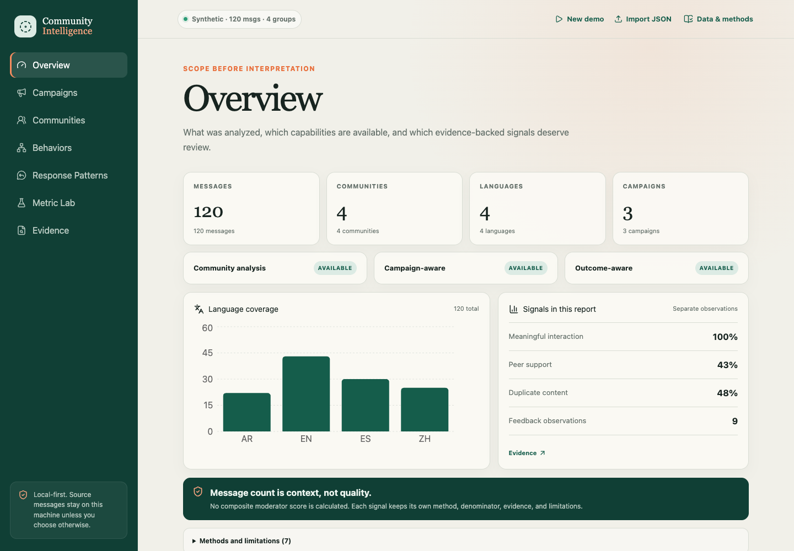
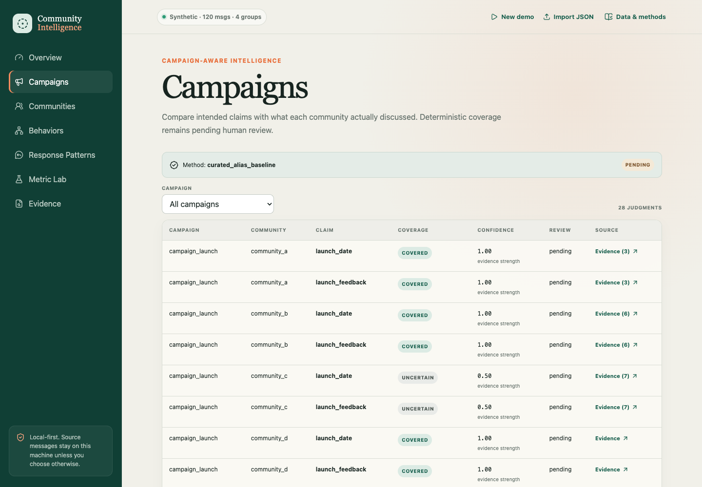
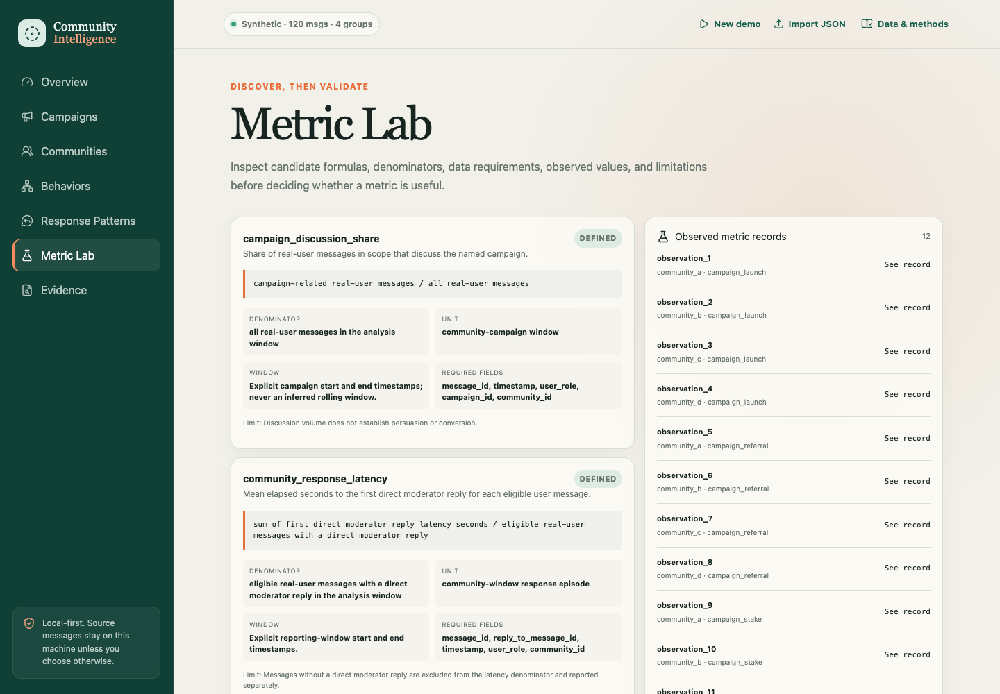

# Community Intelligence AI

这是 Community Intelligence AI 的新版开发工作区。产品唯一依据是 [`docs/product/COMMUNITY_INTELLIGENCE_AI_PRD_V2_1.md`](docs/product/COMMUNITY_INTELLIGENCE_AI_PRD_V2_1.md)。

当前目录是后续唯一 active development workspace，并已继承 v0.1 的完整 Git history（基线 `b5d5d02` / `v0.1.0-alpha`）。现有 `src/`、`frontend/`、`tests/` 和旧文档均作为 legacy assets 原地保留；新版在同一仓库内按能力渐进迁移/重构，不清空重建。原目录 `/Users/enm1cuarto/Documents/Codex/community-intelligence-ai` 保持不变，只作只读备份。

评审入口：

1. [`docs/00_TAKEOVER_AND_CAPABILITY_MATRIX.md`](docs/00_TAKEOVER_AND_CAPABILITY_MATRIX.md)
2. [`docs/01_LOW_FI_IA_AND_CORE_FLOWS.md`](docs/01_LOW_FI_IA_AND_CORE_FLOWS.md)
3. [`docs/02_TECHNICAL_DESIGN.md`](docs/02_TECHNICAL_DESIGN.md)
4. [`docs/03_DEVELOPMENT_TASKS.md`](docs/03_DEVELOPMENT_TASKS.md)
5. [`docs/04_PRODUCT_OWNER_DECISIONS.md`](docs/04_PRODUCT_OWNER_DECISIONS.md)

状态词统一使用：`Implemented`、`Verified`、`Experimental`、`Planned`、`Unavailable`、`Not implemented`。规划文档不得被当作已实现能力。

## Legacy v0.1 baseline（原地保留）

以下内容保留 v0.1 的运行方式与能力边界；开发 v2.1 时继续把它作为回归基线。

> **v0.1.0-alpha** · Local-first public alpha · Synthetic-first and evidence-linked

Community Intelligence AI helps people understand how multilingual communities respond—not merely how much they talk. It turns a Telegram Desktop export or a reproducible synthetic dataset into seven connected views covering campaigns, communities, behaviors, response patterns, candidate metrics, and source evidence.

The project grew from managing more than ten multilingual Web3 Telegram communities. Message count was easy to measure but easy to game; keyword hit rate was more relevant but could not handle translation, semantic completeness, or what happened after a campaign was posted. The resulting product principle is simple: **message count is context, not community quality**. AI may discover candidate patterns and metrics, statistics may test them, and people make the final judgment.

## Run it in 3–5 minutes

You need Python 3.11+ and [uv](https://docs.astral.sh/uv/). Clone the repository, then run:

```bash
uv sync
uv run community-intelligence serve
```

The command starts a loopback-only local server at `http://127.0.0.1:8765/` and opens the product in your browser. Click **Run synthetic demo** for an immediate reproducible analysis. To use your own data, export one chat from Telegram Desktop as machine-readable JSON, click **Import Telegram JSON**, and select its `result.json` file. V0.1 processes the upload locally and does not send it to a cloud service.



Use `--no-open` to suppress automatic browser opening, or `--port 8989` to select another local port.

## What works in V0.1

- Synthetic multilingual data generation across English, Spanish, Chinese, and Arabic.
- Bounded Telegram Desktop JSON import with rich-text/reply normalization and hashed user/community identifiers.
- Deterministic hygiene, activation, feedback, reply-episode, campaign-coverage, behavior-clustering, metric-definition, and statistical-validation baselines.
- Seven responsive report views with joinable source evidence, method labels, confidence semantics, limitations, and review status.
- Community-only, Campaign-aware, and Outcome-aware capability states that distinguish `available`, `not_available`, and `not_implemented`.
- Installed CLI, loopback FastAPI adapter, packaged React product, automated tests, and fresh-wheel release verification.

The product does not calculate an unvalidated composite Moderator Score. Statistical results are descriptive associations, not causal effects.

## Product views

The Campaigns view compares intended claims with community discussion while keeping the deterministic baseline and pending human review visible.



Metric Lab keeps formulas, denominators, required fields, units, windows, observations, and limitations together before a candidate signal is adopted.



The versioned [low-fidelity wireframes](docs/wireframes/README.md) show how the seven-view information architecture evolved before visual polish.

## Honest capability boundaries

| Capability | V0.1 status |
| --- | --- |
| General multilingual semantic campaign judgment | **Not implemented** |
| LLM-generated behavior naming | **Not implemented** |
| Semantic retrieval inside the default report pipeline | **Not implemented** |
| Real-time Telegram ingestion | **Not implemented** |
| Discord integration, accounts, billing, hosted multi-user service | Outside V0.1 |

The optional embedding provider has a separate local evaluation path, but the default report pipeline does not silently download or call a model. Telegram import supports a deliberate subset of Telegram Desktop chat-history JSON: ordinary text/rich-text messages, timestamps, authors, and reply relationships. Service and empty messages are skipped. Telegram exports do not reliably identify moderators, so imported roles default to `user`; the report exposes this limitation.

## CLI workflows

The web product is the easiest entry point. Reproducible CLI workflows remain available:

```bash
# Complete synthetic dataset + report workspace
uv run community-intelligence demo --workspace demo --messages 120

# Telegram JSON → normalized dataset → community-only report
uv run community-intelligence import telegram \
  --input result.json \
  --output data/my-community \
  --language en
uv run community-intelligence analyze \
  --input data/my-community \
  --output reports/my-community
```

Every output directory is create-only: existing paths are preserved rather than overwritten.

## Development and verification

```bash
uv sync
uv run ruff check src tests
uv run pytest -q

npm --prefix frontend ci
npm --prefix frontend test
npm --prefix frontend run typecheck
npm --prefix frontend run lint
npm --prefix frontend run build
```

Browser tests use Playwright. Run `npm --prefix frontend exec -- playwright install chromium`, start the local product with `community-intelligence serve --no-open`, then run `npm --prefix frontend run test:e2e`. Maintainers can run `./scripts/verify_release.sh` for the complete lint, test, build, fresh-wheel install, Telegram import, packaged-service, and browser release path.

## Documentation

- [Product story](docs/PRODUCT_STORY.md) and [Chinese product specification](docs/product/PRODUCT_SPEC_CN.md)
- [Architecture](docs/ARCHITECTURE.md), [metrics](docs/METRICS.md), [evaluation](docs/EVALUATION.md), and [privacy](docs/PRIVACY.md)
- [OSS reuse audit](docs/OSS_REUSE_AUDIT.md) and [third-party notices](THIRD_PARTY_NOTICES.md)
- [V0.1.0-alpha release notes](docs/release-notes-v0.1.0-alpha.md)
- [Contributing](CONTRIBUTING.md) and [security policy](SECURITY.md)

## License

Community Intelligence AI is licensed under Apache-2.0. Direct dependency licenses and reuse decisions are summarized in [THIRD_PARTY_NOTICES.md](THIRD_PARTY_NOTICES.md); lock files remain the authoritative resolved dependency inventory for a specific build.
